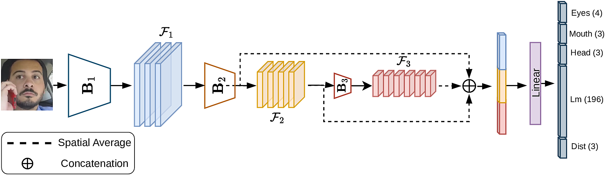

# Low-Latency Embedded Driver Monitoring System with a Multi-Task Neural Network
**Carmelo Scribano**, **Giovanni Cappelletti**, **Elia Giacobazzi**, **Giorgia Franchini**, **Paolo Burgio** and **Marko Bertogna**\
*To be presented at [RAGE](https://rage-workshop.github.io/2026/) worksop@CpS Iot Week.*

## About this repo
This is the repository that accompanies the paper *"Low-Latency Embedded Driver Monitoring System with a Multi-Task Neural Network"*.

### Multi-Task Model
<p align="center">
  
</p>
</p>

The proposed model takes as input a $160\times160$ RGB input tightly enclosing a human face and provides the following outputs:
* 98 facial landmarks
* Eye Visibility
* Eye Opening level
* Mouth Opening level
* Head Rotation
* Engagement in distracting activi (Smoking, Cellphone Usage).

Please refer to the paper and the inference code for further details.

### Reference Code
The simplified implementation released in this repository serves as a minimal example of the inference pipeline, providing a useful starting point for porting and evaluation across various inference platforms (TensorRT, NPU, Edge TPU, etc.). In this example, OnnxRuntime is used for inference. This implementation is not intended as a benchmark for inference performance; the results reported in the paper are obtained using TensorRT on the Jetson Orin Nano platform.

The reference implementation use [Ultra-Light-Fast-Generic-Face-Detector-1MB](https://github.com/Linzaer/Ultra-Light-Fast-Generic-Face-Detector-1MB) for face detection and an implementation of [SORT](https://arxiv.org/abs/1602.00763) for tracking.

## Weights Avaliability
We are preparing a form to distribute the trained model to anyone who is interested. Weights will be available solely for non-commercial research purposes.

## Licence
All content in this repository is released for non-commercial use under the [CC BY-NC 4.0](https://creativecommons.org/licenses/by-nc/4.0/deed.it) license.

# Reference
If you found this material useful and would like to use it in your work, please consider citing our paper.
```
The reference will be added after publication
```